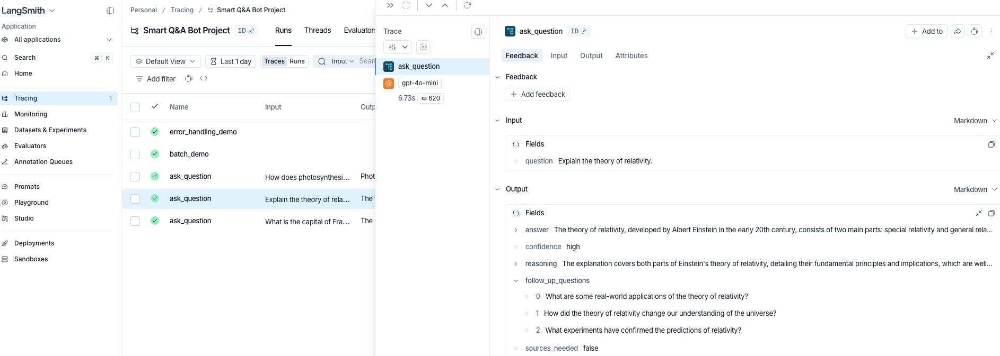
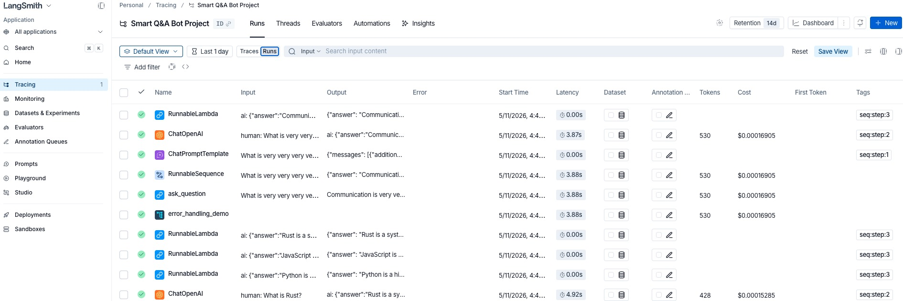
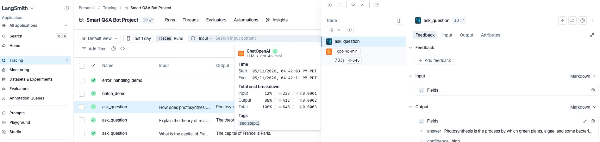

# Production AI Agents

Multi-agent AI systems built with LangChain, LangGraph, and FastAPI, featuring RAG pipelines, vector databases, LLM orchestration, secure prompt handling, evaluation workflows, and production deployment.

# 🤖 Building Production-Ready RAG & Memory Systems with LangChain

A hands-on project exploring modern Retrieval-Augmented Generation (RAG), Vector Search, and Conversation Memory using LangChain and OpenAI.

Instead of building a simple chatbot, this project implements several production-ready patterns including:

- Retrieval-Augmented Generation (RAG)
- Vector databases (Chroma)
- Source attribution
- Structured outputs
- Conversation memory
- Windowed memory
- Summary memory
- Persistent memory with SQLite
- Document Question Answering

---

# 🚀 Project Architecture

```text
Knowledge Base
       │
       ▼
Document Loader
       │
       ▼
Text Splitter
(RecursiveCharacterTextSplitter)
       │
       ▼
OpenAI Embeddings
(text-embedding-3-small)
       │
       ▼
Chroma Vector Database
       │
       ▼
Retriever
       │
       ▼
Prompt Template
       │
       ▼
GPT-4o-mini
       │
       ▼
Final Response
```

---

# 📚 What I Built

## 1. Basic RAG Pipeline

Implemented an end-to-end Retrieval-Augmented Generation workflow using LangChain Expression Language (LCEL).

Pipeline:

```
User Question
      │
      ▼
Retriever
      │
      ▼
Relevant Context
      │
      ▼
Prompt Template
      │
      ▼
GPT-4o-mini
      │
      ▼
Answer
```

**Key Concepts**

- Vector Search
- Prompt Engineering
- LCEL Pipelines
- Chroma Vector Store

---

## 2. RAG with Source Attribution

Enhanced the retrieval pipeline by attaching metadata to every retrieved document.

Example Output

```
Answer:
...

Sources:
[1] langchain_knowledge_base.md
```

### Benefits

- Improves explainability
- Easier debugging
- Better user trust

---

## 3. RAG with Fallback Responses

Implemented guardrails to reduce hallucinations.

Instead of generating unsupported answers, the assistant replies:

> "I don't have information about that in my knowledge base."

This pattern is commonly used in enterprise AI assistants.

---

## 4. Structured RAG

Instead of returning plain text, the model generates structured JSON using Pydantic.

Example schema:

```python
class RAGResponse(BaseModel):
    answer: str
    confidence: str
    sources_used: List[str]
    follow_up: str
```

This makes downstream applications easier to build.

---

## 5. Document Question Answering

Built a reusable DocumentQA class that:

- accepts any text document
- chunks the document
- creates embeddings
- stores vectors
- supports multiple questions

Pipeline:

```
Document
     │
     ▼
Chunking
     │
     ▼
Embedding
     │
     ▼
Vector Store
     │
     ▼
Retriever
     │
     ▼
Question Answering
```

---

# 🧠 Conversation Memory

The second half of this project focuses on production conversation memory.

---

## 6. Basic Conversation Memory

Implemented

- RunnableWithMessageHistory
- InMemoryChatMessageHistory

The assistant remembers previous interactions within a session.

---

## 7. Multi-User Sessions

Implemented independent conversation histories using session IDs.

```
User A
   │
   ▼
Memory A

User B
   │
   ▼
Memory B
```

Each user has isolated conversation history.

---

## 8. Message Trimming

Implemented automatic trimming to stay within the model context window.

Features

- keep system prompt
- remove oldest messages
- token-aware trimming

---

## 9. Windowed Memory

Implemented a sliding window memory.

```
Conversation

Exchange 1 ❌ Removed

Exchange 2 ❌ Removed

Exchange 3 ✅

Exchange 4 ✅
```

Benefits

- predictable token usage
- constant memory size
- low latency

---

## 10. Summary Memory

Implemented automatic conversation summarization.

Instead of deleting old messages:

```
Old Messages
      │
      ▼
LLM Summary
      │
      ▼
Compact Context
```

Benefits

- preserves long-term facts
- reduces token costs
- scales to long conversations

---

## 11. Persistent Memory (SQLite)

Implemented persistent chat history using

- SQLChatMessageHistory
- SQLite

Unlike in-memory storage, conversations survive application restarts.

```
User
   │
   ▼
SQLite Database
   │
   ▼
Reload History
   │
   ▼
Continue Conversation
```

---

## 12. Persistent Memory Verification

Built a proof-of-concept demonstrating that memory survives between completely separate program executions.

The project

- stores conversation
- destroys the chain
- rebuilds the chain
- reloads memory from SQLite

This simulates a production chatbot restart.

---

# 🛠 Tech Stack

### LLM

- GPT-4o-mini

### Framework

- LangChain
- LangChain Expression Language (LCEL)

### Embeddings

- OpenAI text-embedding-3-small

### Vector Database

- Chroma

### Memory

- RunnableWithMessageHistory
- InMemoryChatMessageHistory
- SQLChatMessageHistory

### Storage

- SQLite

### Validation

- Pydantic

### Python

- Python 3.12

---

# 📖 Key Concepts Learned

- Retrieval-Augmented Generation (RAG)
- Vector Search
- Embeddings
- Semantic Search
- Prompt Engineering
- Source Attribution
- Structured Output
- Conversation Memory
- Sliding Window Memory
- Summary Memory
- Persistent Memory
- Session Management
- LCEL Pipelines
- LangChain Architecture
- Chroma Vector Database
- SQLite Chat History

---

# 💡 Key Takeaways

Throughout this project, I learned how production LLM applications extend beyond simply calling an API. A robust GenAI system requires reliable retrieval, context management, structured outputs, and scalable memory strategies.

By implementing multiple RAG architectures and memory mechanisms, I gained hands-on experience with many of the core building blocks used in enterprise AI assistants, internal knowledge systems, and production conversational AI applications.

Environment notes
- Demos call `load_dotenv()`; secrets may be provided via a `.env` file.
- To enable LangSmith tracing, set `LANGSMITH_API_KEY`. Optionally set `LANGSMITH_PROJECT` to group traces.

Files (short overview)
- `smart_bot_section1.py` — Smart Q&A bot with `QAResponse` schema, `SmartQABot` class, and LangSmith `@traceable` usage (batch/error demos).
- `chains_v1.py` — LCEL chain patterns: basic chains, `RunnableParallel`, passthroughs, `RunnableBranch`, and debugging examples.
- `core_concepts.py` — Core LCEL/runnable demos, streaming, schema inspection, and exercises.
- `prompt_templates_all.py` — Prompt templates, placeholders, few-shot examples, and composition.
- `prompt_messages.py` — Message templates and few-shot prompt construction.
- `working_with_llms.py` — Multi-provider LLM initialization, model comparisons, streaming, and cost-aware patterns.
- `output_parsers_demo.py` — `StrOutputParser`, `JsonOutputParser`, and Pydantic/structured examples.
- `output_parsers_final.py` — Detailed structured-output demos and complex schemas.
- `main.py` — Quick provider/version checks and smoke tests.

LangSmith (traces & visuals)
- Smart Q&A demo screenshot:  
	
- LangSmith run trace example:  
	
- Token cost breakdown per query:  
	


